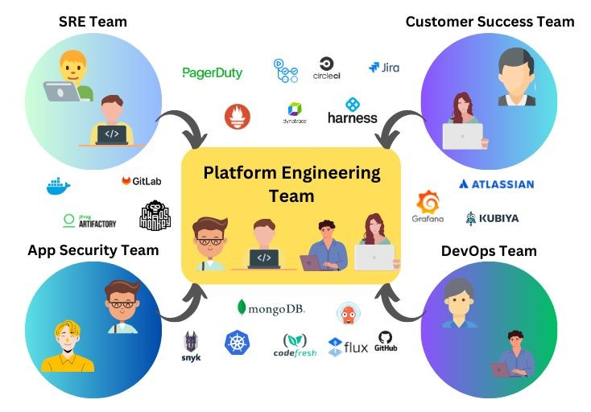

# Awesome Platform Engineering Tools 

<!--lint ignore no-dead-urls-->

A curated list of Platform and Production Engineering tools - Maintained by [Saif Rajhi](https://twitter.com/RajhiSaifeddine)

   

## Contents

- [Awesome Platform Engineering Tools](#awesome-platform-engineering-tools-)
  - [Contents](#contents)
  - [Articles and Presentations and Books](#articles-and-presentations-and-books)
  - [Newsletters, Chats and Podcasts](#newsletters-chats-and-podcasts)
  - [Specifications](#specifications)
  - [Reference Architecture](#reference-architecture)
  - [AI powered platform tools](#ai-powered-platform-tools)
  - [Development](#development)
    - [Source Code Management](#source-code-management)
    - [Feature flags and change management](#feature-flags-and-change-management)
    - [Project Management \& Issue Tracking Software](#project-management--issue-tracking-software)
    - [Bug / Defect Tracking Software](#bug--defect-tracking-software)
    - [Code Editors and IDE's](#code-editors-and-ides)
  - [Continuous Testing](#continuous-testing)
  - [Continuous Integration](#continuous-integration)
    - [Build](#build)
    - [Integration](#integration)
  - [Continuous Delivery](#continuous-delivery)
    - [Deployment](#deployment)
    - [Automation and Collaboration](#automation-and-collaboration)
    - [Infrastructure orchestration](#infrastructure-orchestration)
    - [Container](#container)
    - [Container Registry](#container-registry)
    - [Container Orchestration](#container-orchestration)
  - [Continuous Monitoring](#continuous-monitoring)
  - [Incident Management / Incident Response / IT Alerting / On-Call](#incident-management--incident-response--it-alerting--on-call)
    - [IT Service Management](#it-service-management)
    - [Incident Communication](#incident-communication)
  - [Security](#security)
  - [Internal Developer Portal](#internal-developer-portal)
  - [Path to senior platform engineer handbook](#path-to-senior-platform-engineer-handbook)
  - [Miscellaneous and Related](#miscellaneous-and-related)
  - [Notions and concepts](#notions-and-concepts)
  - [Stargazers over time](#stargazers-over-time)
  - [Licence](#licence)

## Articles and Presentations and Books

- [Chances are you don't need a platform team](https://theprogressivearchitect.substack.com/p/chances-are-you-dont-need-a-platform) - How to minimize your platform and maximize user value by [@bschaatsbergen](https://github.com/bschaatsbergen) .
- [How To Create A Complete Internal Developer Platform (IDP)?](https://www.youtube.com/watch?v=Rg98GoEHBd4) - It's time to build an internal developer platform (IDO) with Crossplane, Argo CD, SchemaHero, External Secrets Operator (ESO), GitHub Actions, Port, and a few others by [@vfarcic](https://gist.github.com/vfarcic) .
- [What does it take to become a Platform Engineer?](https://www.youtube.com/watch?v=1RInP-77iyE) .
- [Platform Engineering How Did We Get Here ](https://www.youtube.com/watch?v=p6D-NYkVp9E) .
- [Can we say that Platform Engineering is DevSec(Rel)Ops?](https://www.youtube.com/watch?v=DhtYf05dvQY) .
- [The Practical Guide to Internal Developer Portals](https://www.getport.io/guide) - The next big thing in DevOps is platform engineering, and the main tool it uses is the internal developer portal. Read this guide to understand what can be done with portals and why they matter .
- [Platform Engineering on Kubernetes](https://www.manning.com/books/platform-engineering-on-kubernetes) - A book that teaches how to build custom platforms on top of Kubernetes using open-source tools such as Dapr, Knative, Argo CD and Rollouts, and Tekton. It explores the tools and techniques needed to overcome common cloud-native challenges and is suitable for readers with different expertise levels .
- [Build Your IDP at Light Speed with a Platform Reference Architecture](https://thenewstack.io/build-your-idp-at-light-speed-with-a-platform-reference-architecture/) - Now organizations have a standard, proven, scalable, and repeatable pattern for internal developer platforms that’s applicable to any tooling choice .
- [What Is Platform Engineering? Role, Principles & Benefits](https://spacelift.io/blog/what-is-platform-engineering).
- [How to Design an Internal Developer Platform](https://blog.container-solutions.com/how-to-design-an-internal-developer-platform).
- [A Platform Team Product Manager Determines DevOps Success](https://thenewstack.io/a-platform-team-product-manager-determines-devops-success/).
- [Platform Engineering KPIs](https://medium.com/wise-engineering/platform-engineering-kpis-6a3215f0ee14).
- [Platform Engineering: Creating your Internal Developer Platform](https://medium.com/contino-engineering/creating-your-internal-developer-platform-part-2-65ff217cecd6).
- [The 10 Platform Engineering Tools To Use in 2022](https://medium.com/@rphilogene/the-10-platform-engineering-tools-to-use-in-2022-c2cbf2561f77).
- [Platform Engineering at Palo Alto Networks](https://medium.com/engineering-at-palo-alto-networks/platform-engineering-at-palo-alto-networks-part-2-315bd7b0fbfa).
- [Platform Engineering story from a CTO: WHY, WHAT, HOW](https://medium.com/agorapulse-stories/platform-engineering-part-1-why-the-evolution-of-developer-cognitive-load-9f36f5cc2888).
- [Create Preview Environments with Terraform, GitHub Actions, and Vercel](https://developer.hashicorp.com/terraform/tutorials/applications/preview-environments-vercel).
- [Guide To Internal Developer Portals](https://www.getport.io/blog/guide-to-internal-developer-portals).
- [Introducing KBOM – Kubernetes Bill of Materials](https://www.aquasec.com/blog/introducing-kbom-kubernetes-bill-of-materials/?trk=article-ssr-frontend-pulse_little-text-block) .
- [Platform Engineering Is Not Just about the Tools](https://thenewstack.io/platform-engineering-is-not-just-about-the-tools/) - Platform engineering isn’t solely about the tools and components but also about alignment within the organization and a special focus on understanding user needs .
- [Platform Engineering Rules the Day](https://thenewstack.io/platform-engineering-rules-the-day-eight-key-themes/) -  Eight Key Themes .
- [Wwhat is Platform Engineering and why it is important for better developer experience](https://medium.com/google-cloud/how-to-start-platform-engineering-practice-to-improve-developer-experience-48bc3e9c96de) - Some of the core tenets of Platform Engineering.
- [5 myths about platform engineering: what it is and what it isn’t](https://cloud.google.com/blog/products/application-development/common-myths-about-platform-engineering) - Five common myths about platform engineering.
- [The ultimate guide to platform engineering](https://www.eficode.com/platform-engineering?utm_campaign=DevOps&utm_content=189322221&utm_medium=social&utm_source=linkedin&hss_channel=lcp-741299) - Stay competetive: embrace platform engineering .
- [Top Platform Engineering KPIs You Need to Monitor](https://medium.com/beyond-the-code-by-typo/top-platform-engineering-kpis-you-need-to-monitor-b14a405b4eb7) - A curated list of top platform engineering KPIs that software teams must monitor .
- [Can ops actually do product management](https://newsletter.cote.io/p/platform-engineering-problems-can) - Platform engineering problems: can ops actually do product management?.
- [Pulumi Platform Engineering](https://www.pulumi.com/blog/scale-ai-innovation-with-platform-engineering/) - Accelerate, Scale and Secure AI Innovation with Pulumi Platform Engineering .
- [Insights to enable your platform engineering team to improve agility and customer focus](https://www.gartner.com/en/infrastructure-and-it-operations-leaders/topics/platform-engineering) - A Platform engineering that empowers users and reduces risk .
- [Can Your Developers Benefit from Platform Engineering?](https://www.informationweek.com/it-leadership/can-your-developers-benefit-from-platform-engineering-) - Will designing tools and workflows to bring self-service to software development help developers work more efficiently? .
- [Platform Engineering: A Guide for Technical, Product, and People Leaders](https://www.amazon.com/dp/B0DJPYQB5X/) - This book guides you on adopting a developer-centric approach to platform engineering, understanding and building platform teams, automating infrastructure, and managing platform scalability and team dynamics. It also covers the role of a platform product manager and improving developer experience through self-service infrastructure. .
- [The Road to Simplicity](https://www.resourcely.io/post/the-road-to-simplicity) - What platform engineering can learn from automobile design .

## Newsletters, Chats and Podcasts

- [Platform Engineering](https://platformengineering.org)
- [Internal Developer Platform](https://internaldeveloperplatform.org)
- [The New Stack](https://thenewstack.io/)
- [Resources about Internal Platform teams and products](https://internalplatforms.com)
- [Humanitec (Platform Engineering) Blog](https://humanitec.com/blog)
- [InfoQ Platform Engineering Articles](https://www.infoq.com/platformengineering/)
- [Port Blog](https://www.getport.io/blog)
- [Platform weekly](https://platformweekly.com/)
- [Platformengineering.org Slack](https://platformengineering.org/slack-rd)
- [What's Platform Engineering? And How Does It Support DevOps?](https://www.listennotes.com/podcasts/the-new-stack/whats-platform-engineering-uoN5mXizUpP/)
- [The New Stack Podcast](https://www.listennotes.com/podcasts/the-new-stack-podcast-the-new-stack-2tdxfCmwZr6/)
- [Platform Engineering with Nicholas Eberts](https://sites.libsyn.com/419861/platform-engineering-with-nicholas-eberts?trk=article-ssr-frontend-pulse_little-text-block)

## Specifications

- [OAM: One Application Model](https://oam.dev/) - An open model for defining cloud native apps.
- [Argonaut](https://www.argonaut.dev/) - Deploy apps and infrastructure on your cloud in minutes.
- [devtron](https://devtron.ai/) - An open source Internal Developer Platform for Kubernetes.
- [SaaS Backstage Roadie](https://roadie.io/) - SaaS Backstage. Simple, safe, and more powerful.
- [ZYMR](https://www.zymr.com/product-platform-engineering-services) - We excell at Platform engineering.
- [CTO: platform for platform teams](https://cto.ai/platform) -  The platform for platform teams : Easily implement your vision for the perfect developer platform without having to build everything from scratch. We’re more than just a CI/CD pipeline. We’re an intelligent automation platform for all of your development workflows.
- [score](https://score.dev) - One easy way to configure all your workload. Everywhere.
- [kubevela](https://kubevela.io/) - Make shipping applications more enjoyable.
- [kusionstack](https://kusionstack.io/) - Open Tech Stack to build self-service, collaborative, reliable and sustainable Internal Developer Platform.
- [Cloud Native Operational Excellence (CNOE)](https://cnoe.io/) - CNOE will enable organizations to navigate tooling sprawl and technology churn by coordinating contributions, offering tools, and providing neutral guidance on technology choices to deliver IDPs.
- [OpenGitOps](https://opengitops.dev/) - OpenGitOps is a set of open-source standards, best practices, and community-focused education to help organizations adopt a structured, standardized approach to implementing GitOps.
- [Open Platform for Enterprise AI](https://opea.dev) - An ecosystem orchestration framework to integrate performant GenAI technologies & workflows leading to quicker GenAI adoption and business value.
- [karpor: Intelligence for Kubernetes.](https://github.com/KusionStack/karpor) - World's most promising Kubernetes visualization Tool for developer and platform engineering teams.

## Reference Architecture

- [The Reference Architecture for Agility is a technology-neutral logical architecture based on a disaggregated cloud-based model](https://github.com/wso2/reference-architecture/tree/master) - A proven approach to helping every development organization become an integration agile organization.
- [CloudGeometry Reference Architecture](https://github.com/CloudGeometry/cg-devx-core) - CloudGeometry Reference Architecture for simplifying the creation and management of DevOps and Cloud resources.
- [AWS Reference Architecture implementation](https://github.com/humanitec-architecture/reference-architecture-aws) - How to spin up your Humanitec AWS Reference Architecture.
- [GCP Reference Architecture implementation](https://github.com/humanitec-architecture/reference-architecture-gcp) - How to spin up your Humanitec Google Cloud Reference Architecture Implementation.
- [Azure Reference Architecture implementation](https://github.com/humanitec-architecture/reference-architecture-azure) - How to spin up your Humanitec Azure Reference Architecture.
- [IBM Cloud Reference Architecture](https://github.com/IBM/ibm-cloud-reference-architectures) -  IBM Infrastructure Automation.
- [Awesome Software Architecture](https://github.com/simskij/awesome-software-architecture) - A curated list of resources on software architecture.

## AI powered platform tools

- [InfraStack AI](https://infrastack.ai/) - AI-Powered Observability Copilot.
- [AI-Powered Incident Management](https://www.transposit.com/) - A solution that combines an on-call AI copilot and end-to-end automation.
- [Monolith](https://www.monolithai.com/) - No-code AI software built for engineers.
- [Viktor](https://www.viktor.ai/) - Implement AI in your engineering workflow.
- [initializ.ai](https://www.initializ.ai/) - AI-Driven Unified DevSecOps Platform.
  
## Development

### Source Code Management

- [Git](https://git-scm.com/)
- [GitHub](https://github.com/)
- [Gitlab](https://about.gitlab.com/)
- [Bitbucket](https://bitbucket.org/)
- [Fossil](https://www.fossil-scm.org/)
- [Mercurial](https://www.mercurial-scm.org/)
- [Perforce Helix Core](https://www.perforce.com/products/helix-core/)
- [Subversion (SVN)](https://subversion.apache.org/)
- [Nvim](https://neovim.io/) - hyperextensible Vim-based text editor.
- [Unleash](https://github.com/Unleash/unleash) - Open-source feature management solution built for developers.
  
### Feature flags and change management

- [OpenFeature: community-developed specification to standardise feature flag management](https://github.com/open-feature#welcome-to-the-openfeature-project-)
- [Launchdarkly: feature flags paid service](https://launchdarkly.com/)
- [Git Guide: Generate A Changelog From Your Git Commit Messages](https://mokkapps.de/blog/how-to-automatically-generate-a-helpful-changelog-from-your-git-commit-messages/)
- [Update NPM, pip, Gem etc. dependencies](https://github.com/renovatebot/renovate)
- [Upgrade microservices](https://www.jhipster.tech/upgrading-an-application/#-upgrading-an-application)
- [Upgrade JavaScript or TypeScript codebases](https://github.com/facebook/jscodeshift)
- [Git Qovery: PR/Commit Preview Environments Platform (paid)](https://hub.qovery.com/guides/tutorial/getting-started-with-preview-environments-on-aws-for-beginners/)
- [Bunnyshell: production replica environments for dev, QA and Staging](https://www.bunnyshell.com/)
- [LocalStack: A fully functional local AWS cloud stack](https://github.com/localstack/localstack)
- [Gitpod: cloud development environments](https://www.gitpod.io/)
- [okteto: spin up dev and preview environments](https://www.okteto.com/)

### Project Management & Issue Tracking Software

- [Jira](https://www.atlassian.com/software/jira)
- [Trello](https://trello.com/)
- [Zoho Sprints](https://www.zoho.com/sprints/)
- [Taiga](https://taiga.io/)
- [Wrike](https://www.wrike.com/)
- [Asana](https://asana.com/)
- [Monday.com](https://monday.com/)
- [Clickup](https://clickup.com/)
- [Basecamp](https://basecamp.com/)
- [Rally](https://www.broadcom.com/products/software/value-stream-management/rally)
- [Teamwork](https://www.teamwork.com/)
- [Redmine](https://www.redmine.org/)
- [Freedcamp](https://www.freedcamp.com/)
- [Shortcut](https://www.shortcut.com/)
- [Azure Boards](https://azure.microsoft.com/en-us/products/devops/boards/)
- [GitHub Projects](https://github.com/features/project-management)
- [GitLab Boards](https://docs.gitlab.com/ee/user/project/issue_board.html)
- [Bitbucket Issues](https://bitbucket.org/product/features/issues)
- [Linear](https://linear.app/)

### Bug / Defect Tracking Software

- [Bugzilla](https://www.bugzilla.org/)
- [Bugsee](https://www.bugsee.com/)
- [Instabug](https://instabug.com/)
- [Zoho BugTracker](https://www.zoho.in/bugtracker/)
- [Bugasura](https://bugasura.io)
- [Mantis Bug Tracker](https://www.mantisbt.org/)
- [Github Issues](https://docs.github.com/en/issues/tracking-your-work-with-issues)

### Code Editors and IDEs

- [GNU Emacs](https://www.gnu.org/software/emacs/)
- [Notepad++](https://notepad-plus-plus.org/)
- [Atom](https://atom.io/)
- [Visual Studio Code](https://code.visualstudio.com/)
- [Sublime Text](https://www.sublimetext.com/)
- [Vim](https://www.vim.org/)
- [Eclipse](https://www.eclipse.org/downloads/)
- [GNU Nano](https://www.nano-editor.org/)
- [UltraEdit](https://www.ultraedit.com/)
- [TextMate](https://macromates.com/)
- [gedit](https://gitlab.gnome.org/GNOME/gedit/)
- [WebStorm](https://www.jetbrains.com/webstorm/)
- [IntelliJ IDEA](https://www.jetbrains.com/idea/)
- [PyCharm](https://www.jetbrains.com/pycharm/)
- [Eclipse Che](https://www.eclipse.org/che/)

## Continuous Testing

- [Selenium](https://www.seleniumhq.org/)
- [JUnit](https://junit.org/)
- [TestNG](https://testng.org/doc/index.html)
- [NUnit](https://nunit.org/)
- [TestSigma](https://testsigma.com/)
- [Unified Functional Testing (UFT)](https://www.microfocus.com/en-us/products/unified-functional-automated-testing/overview)
- [Tricentis Tosca](https://www.tricentis.com/products/automate-continuous-testing-tosca/)
- [IBM Rational Functional Tester](https://www.ibm.com/in-en/marketplace/rational-functional-tester)
- [TestComplete](https://smartbear.com/product/testcomplete/overview/)
- [Waitr](http://watir.com/)
- [Zephyr](https://www.getzephyr.com/)
- [accelQ](https://www.accelq.com/)
- [Apache jMeter](https://jmeter.apache.org/)
- [Appium](https://appium.io/)
- [steadybit](https://www.steadybit.com/)
- [k6](https://k6.io/)
- [Apache JMeter](https://jmeter.apache.org/)
- [Gatling](https://gatling.io/)
- [Cypress](https://www.cypress.io/)
- [TestRail](https://www.gurock.com/testrail/)

## Continuous Integration

### Build

- [Ninja](https://ninja-build.org/)
- [Meson](https://mesonbuild.com/)
- [CMake](https://cmake.org/)
- [Autotools/Automake](https://www.gnu.org/software/automake/)
- [premake](https://premake.github.io/)
- [Maven](https://maven.apache.org/)
- [Ant](https://ant.apache.org/)
- [Gradle](https://gradle.org/)
- [Make](https://www.gnu.org/software/make/)
- [Cake](https://cakebuild.net/)
- [Rake](https://ruby.github.io/rake/)
- [MS Build](https://www.microsoft.com/en-us/build)
- [Drill](https://gitlab.com/aki237/drill)
- [Hydra](https://nixos.org/hydra/)
- [Bazel](https://bazel.io)
- [Azure DevOps](https://azure.microsoft.com/en-us/services/devops/)

### Integration

- [Jenkins](https://jenkins.io/)
- [Bamboo](https://www.atlassian.com/software/bamboo)
- [Hudson](http://hudson-ci.org/)
- [CircleCI](https://circleci.com)
- [TeamCity](https://www.jetbrains.com/teamcity/)
- [Gitlab CI](https://about.gitlab.com/product/continuous-integration/)
- [Travis CI](https://travis-ci.org/)
- [AWS CodeStar](https://aws.amazon.com/codestar/)
- [Buildbot](https://buildbot.net/)
- [Semaphore CI](https://semaphoreci.com/)
- [Concourse CI](https://concourse-ci.org/)
- [Abstruse CI](https://github.com/bleenco/abstruse)
- [Appcenter](https://appcenter.ms/)
- [Appveyor](https://ci.appveyor.com/)
- [Assertible](https://assertible.com/)
- [Badwolf](https://github.com/bosondata/badwolf)
- [Britise](https://bitrise.io/)
- [Buildkite](https://buildkite.com/)
- [Chrono CI](http://www.chronoci.com/)
- [Codacy](https://www.codacy.com/)
- [CodeClimate](https://www.codeclimate.com/)
- [CodeFresh](https://codefresh.io/)
- [Codeship](https://www.codeship.io/)
- [Continuousphp](https://continuousphp.com/)
- [Drone](https://drone.io/)
- [Hound CI](https://houndci.com/)
- [Probo.CI](https://probo.ci/)
- [Solano CI](https://xebialabs.com/technology/solano-ci/)
- [Visual Studio Team Services](https://www.visualstudio.com/team-services/)
- [Go CD](https://www.gocd.org/)
- [Pipelight](https://pipelight.dev/)

## Continuous Delivery

### Deployment

- [AWS CodeDeploy](https://aws.amazon.com/codedeploy/)
- [ElectricFlow](http://electric-cloud.com/products/electricflow/)
- [Octopus Deploy](https://octopus.com/)
- [IBM UrbanCode](http://www-03.ibm.com/software/products/en/ucdep)
- [DeployBot](https://deploybot.com/)
- [Shippable](https://app.shippable.com/)
- [Codar Continuous Delivery](https://www.microfocus.com/en-us/products/codar-continuous-deployment/overview)
- [Wercker](https://app.wercker.com/)
- [Humanitec](https://humanitec.com/)
- [ArgoCD](https://argo-cd.readthedocs.io/en/stable/)
- [FluxCD](https://fluxcd.io/)
- [Jenkins X](https://jenkins-x.io/) - CI/CD including everything you need to start exploring Kubernetes
- [Tekton](https://tekton.dev/)
- [Buddy Works](https://buddy.works/)
- [werf](https://werf.io/)
- [Google Cloud Build](https://cloud.google.com/build)
- [Spinnaker](https://spinnaker.io/)
- [Kluctl](https://kluctl.io) - Easily handle Kubernetes deployments of any size, complexity, and across various environments using the push based CLI or pull based GitOps.
- [Walrus](https://www.seal.io/) - An open-source application management platform based on IaC tools including OpenTofu, Terraform and others. It helps platform engineers build golden paths for developers and empowers developers with self-service capabilities.
- [dyrector.io](https://github.com/dyrector-io/dyrectorio) - dyrector.io is a self-hosted continuous delivery & deployment platform with version management.
- [ketch](https://github.com/theketchio/) - Application delivery framework that facilitates the deployment and management of applications on Kubernetes using a simple command line interface.

### Automation and Collaboration

- [Digger](https://www.digger.dev/) - Infrastructure as code management platform that enables you to run OpenTofu & Terraform in your CI/CD system.
- [Atlantis](https://www.runatlantis.io/) — Open Source Terraform Pull Request Automation tool.
- [Env0](https://www.env0.com/) — Automate and Manage IaC at Scale, With Confidence
- [Spacelift](https://spacelift.io/) — Spacelift is a sophisticated CI/CD platform for OpenTofu, Terraform, Terragrunt, CloudFormation, Pulumi, Kubernetes, and Ansible.
- [Terramate](https://terramate.io/) — Terramate adds powerful capabilities such as code generation, stacks, orchestration, change detection, data sharing and more to Terraform.
- [Terrateam](https://terrateam.io/) — Infrastructure as Code CI/CD for GitHub
- [OTF](https://docs.otf.ninja/latest/) — An open source alternative to terraform enterprise.
- [Hatchet](https://docs.hatchet.run/) — An all-in-one platform to automate, secure and monitor Terraform
- [GitHub Actions](https://docs.github.com/en/actions) - Automate, customize, and execute your software development workflows right in your repository
- [Runme](https://runme.dev) - Infrastructure Notebooks Built with Markdown. Runme is a free tool that enables Markdown files to become runnable notebooks. You can use scripts in Shell, Perl, Python, and more.

### Infrastructure orchestration

- [Vagrant](https://www.vagrantup.com/)
- [Puppet](https://puppet.com/)
- [Chef](https://www.chef.io/)
- [SaltStack](https://www.saltstack.com/)
- [Ansible](https://www.ansible.com/)
- [Terraform](https://www.terraform.io/)
- [OpenTofu](https://opentofu.org/)
- [Terragrunt](https://terragrunt.gruntwork.io/) - DRY and maintainable Terraform code.
- [Pulumi](https://www.pulumi.com/)
- [AWS CloudFormation](https://aws.amazon.com/cloudformation/)
- [Rundeck](https://www.rundeck.com/)
- [Selefra](https://www.selefra.io/)
- [Scalr](https://www.scalr.com/)
- [Google Cloud Deployment Manager](https://cloud.google.com/deployment-manager/)
- [OPS](https://ops.city)
- [Helm](https://helm.sh/) - The package manager for Kubernetes
- [Helmfile](https://helmfile.readthedocs.io/en/latest/) - Deploy Kubernetes Helm Charts
- [Crossplane](https://www.crossplane.io/)
- [Packer](https://www.packer.io/)
- [Kubestack](https://github.com/kbst/terraform-kubestack)
- [Shipyard](https://shipyard.build/) - Ephemeral environment management platform.

### Container

- [Depot](https://depot.dev/)
- [Docker](https://www.docker.com/)
- [Turbo.NET](https://turbo.net/)
- [WinDocks](https://windocks.com/)
- [Podman](https://podman.io/)
- [containerd](https://containerd.io/)
- [OpenShift](https://www.openshift.com/)

### Container Registry

- [Docker Hub](https://hub.docker.com/)
- [Google Container Registry](https://cloud.google.com/container-registry/)
- [Amazon ECR](https://aws.amazon.com/ecr/)
- [Gitlab Container Registry](https://about.gitlab.com/2016/05/23/gitlab-container-registry/)
- [JFrog Artifactory](https://jfrog.com/artifactory/)
- [Quay.io](https://quay.io/)
- [Azure Container Registry](https://azure.microsoft.com/en-in/services/container-registry/)
- [Oracle Container Registry](https://container-registry.oracle.com)
- [Nexus Container Registry](https://help.sonatype.com/repomanager3/formats/docker-registry)
- [Harbor](https://goharbor.io/)

### Container Orchestration

- [Kubernetes](https://kubernetes.io/)
- [Nomad](https://github.com/hashicorp/nomad)
- [Docker Swarm](https://docs.docker.com/engine/swarm/)
- [Apache Mesos](https://mesos.apache.org/) - with [Marathon](https://mesosphere.github.io/marathon/)

## Continuous Monitoring

- [AWS CloudWatch](https://aws.amazon.com/cloudwatch/)
- [DebugBear](https://www.debugbear.com/)
- [Prometheus](https://prometheus.io/)
- [StackDriver](https://cloud.google.com/stackdriver/)
- [Sensu](https://sensu.io/)
- [Sentry](https://sentry.io/welcome/)
- [CopperEgg](https://www.idera.com/infrastructure-monitoring-as-a-service)
- [Crashlytics](https://fabric.io/kits/android/crashlytics)
- [Kapacitor](https://www.influxdata.com/time-series-platform/kapacitor/)
- [loggly](https://www.loggly.com/)
- [logmatic](https://logmatic.io/)
- [Logstash](https://www.elastic.co/products/logstash)
- [MongoDB Atlas](https://www.mongodb.com/cloud/atlas)
- [MongoDB Cloud Manager](https://www.mongodb.com/cloud/cloud-manager)
- [NewRelic](https://newrelic.com/)
- [Papertrail](https://papertrailapp.com/)
- [Pingdom](https://tools.pingdom.com/)
- [ServerDensity](https://www.serverdensity.com/)
- [Zabbix](https://www.zabbix.com/)
- [InsightOps](https://www.rapid7.com/products/insightops/)
- [AppSignal](https://appsignal.com)
- [Grafana](https://grafana.com)
- [VictoriaMetrics](https://github.com/VictoriaMetrics/VictoriaMetrics/)
- [Chaos Genius](https://www.chaosgenius.io/)
- [Thanos](https://thanos.io/)
- [Mimir](https://grafana.com/oss/mimir/)
- [Hydrozen.io](https://hydrozen.io) - Uptime monitoring & Statuspages
- [Steampipe.io](https://steampipe.io) - Universal SQL interface to any cloud API
- [Better Stack](https://betterstack.com/)
- [Netdata](https://netdata.cloud)
- [DoctorGPT](https://github.com/ingyamilmolinar/doctorgpt) - Brings GPT into production for application log error monitoring
- [Dynatrace](https://www.dynatrace.com/)
- [Datadog](https://www.datadoghq.com/)
- [Elastic APM](https://www.elastic.co/apm)
- [Healthchecks.io](https://healthchecks.io)
- [OnlineOrNot](https://onlineornot.com/) - Uptime monitoring for websites, APIs, and cron jobs, with integrated status pages.
- [ELK Stack (Elasticsearch, Logstash, Kibana)](https://www.elastic.co/elastic-stack)
- [VictoriaLogs database for logs from VictoriaMetrics](https://docs.victoriametrics.com/victorialogs/)
- [OpenTelemetry](https://opentelemetry.io/)
- [Fluentd CNCF- a Distributed Tracing Platform](https://github.com/fluent/fluentd)
- [Jaeger CNCF: Unified Logging Layer](https://github.com/jaegertracing/jaeger)
- [Infracost- cost estimates for Terraform](https://github.com/infracost/infracost)
- [OpenCost — open source cost monitoring tool for Kubernetes](https://github.com/opencost/opencost)
- [Apache SkyWalking — Application Performance Monitoring](https://github.com/apache/skywalking)
- [SigNoz- an open-source alternative to DataDog, NewRelic, etc.](https://github.com/signoz/signoz)
- [Loki - low cost open source logging; self-hosted or SaaS](https://grafana.com/oss/loki/)
- [SigLens](https://github.com/siglens/siglens)

## Incident Management / Incident Response / IT Alerting / On-Call

- [Squadcast](https://www.squadcast.com)
- [PagerDuty](https://www.pagerduty.com/)
- [VictorOps](https://victorops.com/)
- [OpsGenie](https://www.opsgenie.com/)
- [AlertOps](https://alertops.com/)
- [Blameless](https://www.blameless.com/)
- [Jira Ops](https://www.atlassian.com/software/jira/ops)
- [OnPage](https://www.onpage.com/)
- [PagerTree](https://pagertree.com/)
- [Cabot](https://cabotapp.com/)
- [AlertAgility](http://www.alertagility.com/)
- [xMatters](https://www.xmatters.com/)
- [Derdack Enterprise Alert](https://www.derdack.com/)
- [Bigpanda](https://www.bigpanda.io/)
- [OpenDuty](https://github.com/ustream/openduty)
- [ngDesk](https://www.ngdesk.com/)
- [Geneos](https://www.itrsgroup.com/products/geneos)
- [FireHydrant](https://www.firehydrant.com)
- [SLO exporter](https://github.com/seznam/slo-exporter)
- [SLO Calculator](https://github.com/last9/slo-computer)
- [Rootly](https://www.rootly.io)
- [Grafana OnCall](https://grafana.com/oss/oncall/)
- [Keep - CLI for alerting](https://github.com/keephq/keep)
- [Better Stack](https://betterstack.com/)
- [Everbridge](https://www.everbridge.com/)
- [Moogsoft](https://www.moogsoft.com/)
- [incident.io](https://incident.io/)
- [AlertManager](https://prometheus.io/docs/alerting/latest/alertmanager/)
- [rootly](https://rootly.com) - Manage incidents directly from Slack
- [Pagerly](https://pagerly.io) - Manage Oncalls and Incidents on Slack

### IT Service Management

- [Homer](https://homer-demo.netlify.app/) - A very simple static homepage for your server.
- [FreshService](https://freshservice.com/)
- [ServiceNow](https://www.servicenow.com/)
- [BMC Remedy](http://www.bmcsoftware.in/it-solutions/remedy-itsm.html)
- [Jira Service Management(formerly Jira Service Desk)](https://www.atlassian.com/software/jira/service-management)
- [Samanage](https://www.samanage.com/)
- [Cherwell](https://www.cherwell.com/products/it-service-management/)
- [SysAid](https://www.sysaid.com/it-service-management-software)
- [ManageEngine Servicedesk plus](https://www.manageengine.com/products/service-desk/)
- [Zendesk](https://www.zendesk.com/)

### Incident Communication

- [Squadcast Statuspages](https://www.squadcast.com/statuspage)
- [StatusPal](https://statuspal.io/?utm_source=github.com&utm_medium=referral&utm_campaign=awesome-devops) - communicate incidents and maintenance effectively with a beautiful hosted status page.
- [Hydrozen.io Statuspages](https://hydrozen.io)
- [Atlassian Statuspages](https://www.atlassian.com/software/statuspage)
- [Instatus Statuspages](https://instatus.com) - Quick and beautiful status page.
- [Cachet](https://cachethq.io/)

## Security

- [Sysdig Secure](https://sysdig.com/)
- [Aqua Security](https://www.aquasec.com/)
- [Wiz](https://www.wiz.io/)
- [Wazuh](https://wazuh.com/)
- [Qualys Cloud Platform](https://www.qualys.com/cloud-platform/)

## Internal Developer Portal

- [Port](https://www.getport.io/)
- [Backstage Software Catalog](https://backstage.io/)
- [OpsLevel](https://www.opslevel.com/)
- [KusionStack](https://www.kusionstack.io/)
- [KubeStack](https://www.kubestack.com/)
- [Radius app](https://radapp.io/) - Open-source, cloud-native, application platform that enables developers and the operators that support them to define, deploy, and collaborate on cloud-native applications across public clouds and private infrastructure.
- [Mia platform](https://mia-platform.eu) - Don’t waste time setting up your platform, just push the code!.
- [Humanitec](https://humanitec.com) - Powering your Internal Developer Platform.
- [Appvia](https://www.appvia.io) - Increase Developer productivity with self-service.
- [qovery](https://www.qovery.com) - Deliver Self-Service Infrastructure Faster.
- [Mogenius](https://mogenius.com) - The Kubernetes Operations Platform.
- [Nullstone](https://www.nullstone.io) - An easy-to-use developer platform that enables developers to quickly deploy any application.
- [Kratix](https://github.com/syntasso/kratix)  - A framework for building Platform-as-a-Product.
- [cycloid](https://www.cycloid.io/platform-engineering) -  Platform Engineering is DevOps with an action plan.
- [Shipa](https://shipa.io/) - Shipa simplifies the way you deploy, secure, and manage applications across cloud native infrastructures by taking an application-centric approach.
- [Upbound](https://www.upbound.io/) - The platform for platform teams.
- [Kubero](https://github.com/kubero-dev/kubero) - A fully self-hosted Internal Developer Platform (IDP).

## Path to senior platform engineer handbook

- [Platform Engineer Career Path](https://4dayweek.io/career-path/platform-engineer) - Everything you need to know to senior platform engineer and beyond.
- [A Guide to shaping your Platform Engineer career](https://medium.com/platform-engineering-unleashed/the-rise-of-the-platform-engineer-a-guide-to-shaping-your-career-2f1348a47ef9) -  Platform Engineering career pathing.

Platform Engineering serves as a distinct and valuable career path within an organization, complementing roles like DevOps and Site Reliability Engineering (SRE). While DevOps and SRE ensure smooth software development processes and reliable, scalable infrastructure respectively, Platform Engineers are entrusted with the unique responsibility of crafting the tools, processes, and platforms on which software development and operational tasks occur

### Platform Engineering Career pathing

### Platform Engineering Roles Summary

**Junior Platform Engineer:**  
Handles routine tasks, troubleshooting, cloud configurations, and code reviews.  
*Skills:* Basic scripting, cloud tech, containerization, Golang, Kubernetes.

**Platform Engineer:**  
Implements features, security, system scaling, and CI/CD tools.  
*Skills:* Advanced cloud platforms, containerization, CI/CD, scripting, Golang, Kubernetes.

**Senior Platform Engineer:**  
Designs architecture, mentors, manages projects, ensures security.  
*Skills:* System architecture, cloud computing, containerization, CI/CD, Golang, Kubernetes.

**Lead Platform Engineer:**  
Leads team, manages projects, strategic decisions, stakeholder interaction.  
*Skills:* Systems design, project management, various tech stacks, Golang, Kubernetes.

**Staff Platform Engineer:**  
Sets technical direction, standards, leads projects, guides cloud services.  
*Skills:* Multiple tech stacks, system design, performance, security, Golang, Kubernetes.

**Principal Platform Engineer:**  
Technical leader, sets vision, strategy, engineering processes, cloud strategy.  
*Skills:* Broad tech expertise, strategic planning, complex engineering processes, Golang, Kubernetes.

**Platform Engineering Manager:**  
Oversees teams, strategic direction, performance, budgeting, alignment with business.  
*Skills:* Technical background, budgeting, talent development, Golang, Kubernetes.

**Senior Manager, Platform Engineering:**  
Sets organization-wide strategy, manages teams, cross-team collaboration, cloud strategy.  
*Skills:* Broad tech knowledge, business understanding, engineering management, Golang, Kubernetes.

**Director of Platform Engineering:**  
Sets vision, plans execution, tech decisions, team structure, budget management, strategic planning.  
*Skills:* Vision setting, strategic planning, cloud strategy, Golang, Kubernetes.

## Miscellaneous and Related

- [Cloud Native Interactive Landscape](https://landscape.cncf.io/)
- [Platformengineering.org tooling list](https://platformengineering.org/platform-tooling)
- [Platform Engineering list](https://github.com/toptechevangelist/awesome-platform-engineering)
- [The 12 Platform Challenges](https://www.syntasso.io/post/the-12-platform-challenges-of-christmas)
- [DevSecOps resources and tooling](https://github.com/TaptuIT/awesome-devsecops/)
- [Architecture- Cloud Design Patterns](https://learn.microsoft.com/en-us/azure/architecture/patterns/)

## Notions and concepts

### Fundamentals

- Keep it simple, stupid. You ain't gonna need it.

- You should think about what to do before you do it.

- You should try to talk about what you’re planning to do before you do it.

- You should think about what you did after you did it.

- Be prepared to throw away something you’ve done in order to do something different.

- Always look for better ways of doing things.

- “Good enough” isn’t good enough.

### Code

- Code is a liability, not an asset. Aim to have as little of it as possible.

- Build programs out of pure functions. This saves you from spending your brain power on tracking side effects, mutated state and actions at a distance.

- Use a programming language with a rich type system that lets you describe the parts of your code and checks your program at compile time.

- The expressivity of a programming language matters hugely. It’s not just a convenience to save keypresses, it directly influences the way in which you write code.

- Choose a programming language that has a good module system, and use it. Be explicit about the public interface of a module, and ensure its interals don't leak out to client code.

- Code is a living construct that is never “done”. You need to tend it like a garden, always improving and tidying it, or it withers and dies.

- Have the same high standards for all the code you write, from little scripts to the inner loop of your critical system.

- Write code that is exception safe and resource safe, always, even in contexts where you think it won’t matter. The code you wrote in a little ad-hoc script will inevitably find its way into more critical or long-running code.

- Use the same language for the little tools and scripts in your system too. There are few good reasons to drop down into bash or Python scripts, and some considerable disadvantages.

- In code, even the smallest details matter. This includes whitespace and layout!

### Design

- Modelling - the act of creating models of the world - is a crucial skill, and one that’s been undervalued in recent years.

- Model your domain using types.

- Model your domain first, using data types and function signatures, pick implementation technologies and physical architecture later.

- Implement functionality in vertical slices that span your whole system, and iterate to grow the system.

- Resist the temptation to use your main domain types to describe interfaces or messages exchanged by your system. Use separate types for these, even if it entails some duplication, as these types will evolve differently over time.

- Prefer immutability always. This applies to data storage as well as in-memory data structures.

- When building programs that perform actions, model the actions as data, then write an interpreter that performs them. This makes your code much easier to test, monitor, debug, and refactor.

- Dependency management is crucial, so do it from day one. The payoff for this mostly comes when your system is bigger, but it’s not expensive to do from the beginning and it saves massive problems later.

- Avoid circular dependencies, always.

### Designing systems

- A better system is often a smaller, simpler system.

- To design healthy systems, divide and conquer. Split the problem into smaller parts.

- Divide and conquer works recursively: divide the system into a hierarchy of simpler sub-systems and components.

- _Corollary: When designing a system, there are more choices than a monolith vs. a thousand “microservices”._

- The interface between parts is crucial. Aim for interfaces that are as small and simple as possible.

- Data dependencies are insidious. Take particular care to manage the coupling introduced by such dependencies.

- Plan to evolve data definitions over time, as they will inevitably change.

- Asynchronous interfaces can be useful to remove temporal coupling between parts.

- Every inter-process boundary incurs a great cost, losing type safety, and making it much harder to reason about failures. Only introduce such boundaries where absolutely necessary and where the benefits outweigh the cost.

- Being able to tell what your system is doing is crucial, so make sure it’s observable.

- Telling what your system has done in the past is even more crucial, so make sure it’s auditable.

- A modern programming language is the most expressive tool we have for describing all aspects of a system.

- This means: write configuration as code, unless it absolutely, definitely has to change at runtime.

- Also, write the specification of the system as executable code.

- And, use code to describe the infrastructure of your system, in the same language as the rest of the code. Write code that interprets the description of your system to provision actual physical infrastructure.

- At the risk of repeating myself: everything is code.

- _Corollary: if you’re writing JSON or YAML by hand, you’re doing it wrong. These are formats for the machines, not for humans to produce and consume. (Don’t despair though: most people do this, I do too, so you’re not alone! Let's just try to aim for something better)._

- The physical manifestation of your system (e.g. choices of storage, messaging, RPC technology, packaging and scheduling etc) should usually be an implementation detail, not the main aspect of the system that the rest is built around.

- It should be easy to change the underlying technologies (e.g. for data storage, messaging, execution environment) used by a component in your system, this should not affect large parts of your code base.

- You should have at least two physical manifestations of your system: a fully integrated in-memory one for testing, and the real physical deployment. They should be functionally equivalent.

- You should be able to run a local version of your system on a developer’s computer with a single command. With the capacity of modern computers, there is absolutely no rational reason why this isn’t feasible, even for big, complex systems.

- There is a running theme here: separate the description of _what_ a system does from _how_ it does it. This is probably the single most important consideration when creating a system.

### Building systems

- For a new system, get a walking skeleton deployed to production as soon as possible.

- Your master branch should always be deployable to production.

- Use feature branches if you like. Modern version control tools make merging easy enough that it’s not a problem to let these be long-lived in some cases.

- Ideally, deploy automatically to production on every update to master. If that’s not feasible, it should be a one-click action to perform the deployment.

- Maintain a separate environment for situations when you find it useful to test code separately from production. Avoid more than one such extra environment, as this introduces overheads and cost.

- Prefer feature flags and similar mechanisms to control what's enabled in production over separate test/staging environments and manual promotion of releases.

- Get in the habit of deploying from master to production from the very beginning of a project. Doing this shapes both your system and how you work with it for the better.

- In fact, follow all these practices from the very beginning of a new system. Retrofitting them later is much, much harder.

### Technology

- Beware of hyped or fashionable technologies. The fundamentals of computer science and engineering don’t change much over time.

- Keep up with latest developments in technology to see how they can help you, but be realistic about what they can do.

- Choose your data storage backend according to the shape of data, types of queries needed, patterns of writes vs. reads, performance requirements, and more. Every use case is different.

- That said, PostgreSQL should be your default and you should only pick something else if you have a good reason.

## Stargazers over time

## Licence

Shield: [![CC BY 4.0][cc-by-shield]][cc-by]

This work is licensed under a [Creative Commons Attribution 4.0 International
License][cc-by].

[![CC BY 4.0][cc-by-image]][cc-by]

[cc-by]: https://creativecommons.org/licenses/by/4.0/
[cc-by-image]: https://i.creativecommons.org/l/by/4.0/88x31.png
[cc-by-shield]: https://img.shields.io/badge/License-CC%20BY%204.0-lightgrey.svg

[Back to Top](#0)
